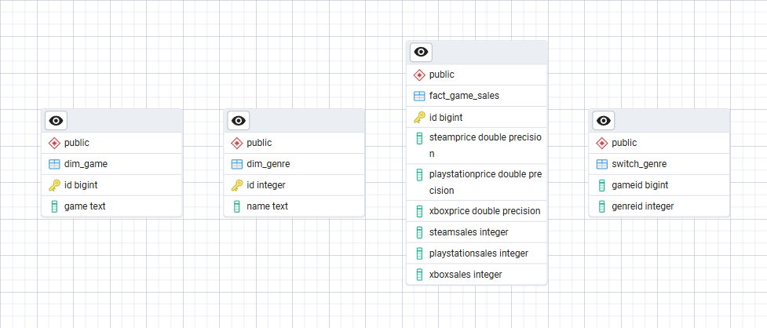
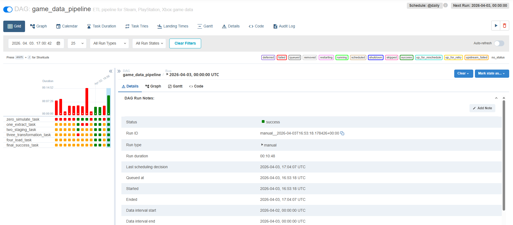
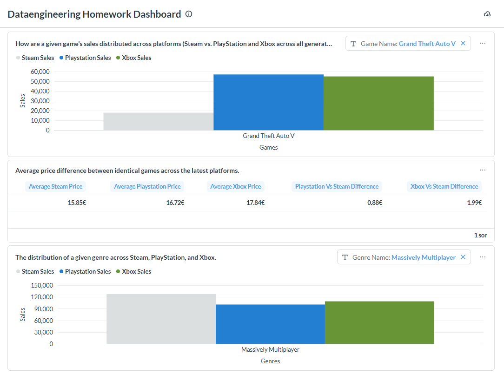

# Házi Feladat Dokumentáció

**Data Engineering** - Opcionális házi feladat

---

## 1. Hallgató adatai

|                |                        |
| -------------- | ---------------------- |
| **Név**        | Horváth Gellért        |
| **Neptun-kód** | BFK4J4                 |
| **E-mail**     | gellihorvath@gmail.com |

---

## 2. Témaválasztás

|                     |                                     |
| ------------------- | ----------------------------------- |
| **Választott téma** | Platform-alapú játékipari analitika |

> A pipeline célja, hogy platformok közötti összehasonlító játékipari elemzéseket fog végezni, különös tekintettel az eladások megoszlására, az árkülönbségekre és a műfajok elterjedtségére. Az alapadatokat a Kaggle Gaming Profiles 2025 CSV állományból fogom nyerni, amelyet kiegészítek a Steam JSON API-ból származó ár- és műfajadatokkal; ezeket előzetesen le fogom tölteni, és egy lokális API-n keresztül fogom kiszolgálni a lekérdezési korlátok miatt. Az így létrehozott, egységesített adathalmaz lehetővé fogja tenni a különböző platformok közötti mélyebb összehasonlító elemzést.
> 
> Megválaszolandó kérdések:
> 
> Egy adott játéknak hogy oszlanak el az eladásai az egyes platformokon (Steam vs Playstation és Xbox összes platform generáció)?
> 
> Átlagos árkülönbség a különböző platformokon lévő játékok árai között.
> 
> Egy adott műfaj eloszlása az egyes platformokon.

---

## Architectúra

A rendszer architektúráját a tanult életciklus modell alapján alakítottam ki, amely a _simulate → extract → staging → transform → load_ lépésekre épül. Ez a felépítés nemcsak logikai szinten jelenik meg, hanem a projekt struktúrájában is jól tükröződik: minden egyes feldolgozási lépés külön Python fájlban kapott helyet. Az egyes fázisok az orchestration rétegben egymásra épülő, különálló taskokként lettek definiálva, így a teljes adatfeldolgozási folyamat jól követhetővé és modulárissá vált. Ennek köszönhetően egy átlátható, könnyen karbantartható és továbbfejleszthető rendszert sikerült létrehozni, amely szorosan illeszkedik a tanult elvekhez.

A nyers és a már strukturált adatok közötti átmeneti tárolásra a fájlrendszert használtam. Ennek elsődleges oka az volt, hogy ez a megoldás bizonyult a legegyszerűbben és leggyorsabban implementálhatónak a projekt kezdeti szakaszában.

Az adatok transzformációját a Pandas könyvtár segítségével valósítottam meg. A választás indoka, hogy a Pandas hatékonyan támogatja a batch jellegű adatfeldolgozást, amely alapkövetelmény volt a projektben, emellett széles körben dokumentált, így gyorsan el lehet sajátítani és hatékonyan alkalmazni.

Az adattárház megvalósításához PostgreSQL adatbázist választottam, mivel ez az a technológia, amellyel a legtöbb tapasztalattal rendelkezem, és korábbi projektjeim során is sikeresen alkalmaztam.

A prezentációs réteget a Metabase biztosítja, amelyen keresztül dashboard formájában jelennek meg az adatok. A Metabase mellett szólt, hogy gyorsan beüzemelhető, valamint egy felhasználóbarát webes felülettel rendelkezik, ami megkönnyíti az adatok vizualizálását és elemzését.

Az orchestration réteg megvalósításához Apache Airflow-t használtam. Mivel korábról nem rendelkeztem tapasztalattal a hasonló eszközök használatában, több alternatívát is kipróbáltam (például a Dagstert), azonban ezek beüzemelése nehézkesnek bizonyult. Hosszabb próbálkozás után végül az Airflow-t sikerült sikeresen konfigurálnom, ezért ezt választottam a folyamatok ütemezésére és kezelésére.

A rendszer reprodukálhatóságát Docker Compose segítségével biztosítottam. Ez lehetővé teszi, hogy a teljes projekt egyetlen paranccsal elindítható legyen bármilyen környezetben, ami jelentős előnyt jelent mind a fejlesztés, mind a telepítés során.

---

## Adatmodell

Az adatmodell egy klasszikus csillagséma (star schema) szerint került kialakításra. A központi ténytábla a `fact_game_sales`, amely a fő mérőszámokat tartalmazza. Ebben a modellben minden egyes játékhoz pontosan egy rekord tartozik, amely normalizált formában tartalmazza az adott játék összes platformra (Steam, PlayStation, Xbox) vonatkozó adatait. Ez magában foglalja az egyes platformokon elérhető árakat, valamint az eladásokat aggregált formában, így egyetlen sorban áttekinthető a játék teljesítménye minden vizsgált platformon.

A nyers adatok feldolgozása során több transzformációs lépés is történt. Az egyik legfontosabb az adattisztítás volt: mivel nem minden játék rendelkezett áradattal minden platformon, az ilyen hiányzó vagy érvénytelen értékeket egységesen `-1`-gyel jelöltem. Ez biztosítja, hogy az adatkészlet konzisztens maradjon, és az ilyen esetek a későbbi lekérdezések során is egyértelműen kezelhetők legyenek. Emellett aggregációt is végeztem: az eladási adatok egy olyan forrástáblából származnak, amely a platformfelhasználók birtokában lévő játékokat tartalmazza, és ezek az értékek platformonként összesítve kerültek be a ténytáblába.

A modellt két dimenziótábla egészíti ki: a `dim_game` és a `dim_genre`. Ezek a lekérdezések egyszerűsítését és hatékonyabbá tételét szolgálják. A `dim_game` tábla a játékok címét tartalmazza, így lehetővé teszi a játékcím szerinti szűrést, míg a `dim_genre` a műfaj szerinti elemzést támogatja. Ennek köszönhetően a Metabase dashboardon a felhasználók interaktív módon választhatnak játéknevet vagy műfajt a szűrőmezőkben, amelyek közvetlenül ezekből a dimenziótáblákból töltődnek fel.

Mivel egy játék több műfajba is tartozhat, a modell tartalmaz egy kapcsolótáblát is `switch_genre` néven. Ez a tábla valósítja meg a több-a-többhöz kapcsolatot a játékok és a műfajok között.

---

## Eredmény

Az Apache Airflow webszerverről készült képernyőképen látható, hogy sokszor próbálkoztam a futtatással, és sokszor hibát is dobott a különböző szakaszokban, viszont ez a jól tagoltság segített jobban beazonosítani a hiba forrását. A képen az is látható, hogy a legutolsó futás sikeres volt. A futás hossza 10 perc 48 másodperc, azért ilyen hosszú mert a Kaggle-ről sok adatot kell letölteni, valamint a csv fájlok nagyon sok sort tartalmaznak 424 ezer Steam, 356 ezer Playstation, 274 ezer Xbox felhasználóról tárolnak információt. A jobb felső sarokban látszik, hogy be van állítva a napi automatikus futás.

A Metabase dashboard lokális, publikus URL-en keresztül érhető el. A dashboardnak szükséges legalább egy pipeline futás a működéshez, mert ekkor jönnek létre a megfelelő táblák az adatbázisban. A képernyőképen egy pipeline futás után látható a prezentáció, amely a három kérdésre adott eredményeket jeleníti meg a lekérdezések alapján. A képen az is látható, hogy két lekérdezés paraméterezhető; amennyiben nincs paraméter megadva, a rendszer az összes eredményt adja vissza.

