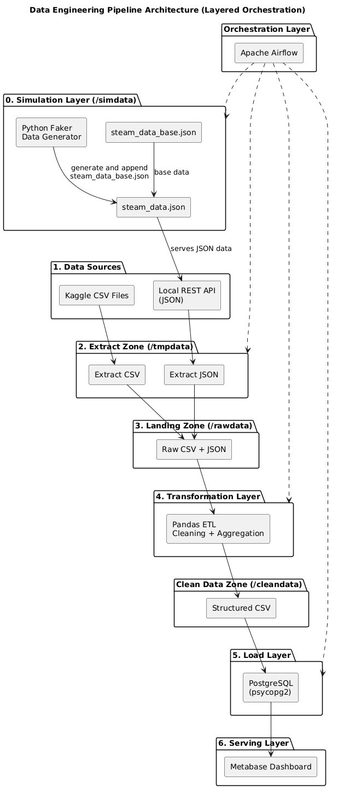

# Data Engineering Homework

Házi feladat projektem a Data Engineering a gyakorlatban tárgyhoz.

## Telepítési és futtatási útmutató

- A futtatáshoz Docker Desktop telepítése szükséges, amit innen tudunk letölteni: [Docker Desktop: The #1 Containerization Tool for Developers | Docker](https://www.docker.com/products/docker-desktop/).

- Clone-ozzuk a git repository-t a számítógépre, a `git clone <url>` paranccsal, vagy töltsük le zip-ként a projektet és csomagoljuk ki.

- Lépjünk be a _/dev_ mappába, és nyissunk meg egy terminált, akár operációs rendszerét, vagy IDE-n (pl: VIsual Studio Code)-on belül.

- Két módban tudjuk elindítani a projektet:
  
  - **Developer mód(egyszerű futtatáshoz nem ez kell)**: 1. `docker-compose --profile dev build`    2. `docker-compose --profile dev up -d`
    A developer módra azért van szükség, mert jobban lehet debugolni, ugyanis ilyenkor a szükséges service konténerekben a programok automatikusan elindulnak, viszont a fő applikáció konténerében a pipeline nem indul el, azt a fejlesztő tudja elindítani, megállítani, ha Visual Studio Code-ban a Dev Containers extension-el belép a fő applikáció konténerbe, és ott futtat közvetlen python parancsokat. Ilyenkor ha hiba lép fel, akkor azt a terminálban a fejlesztő egyből látja, és nem kell a sok log között kikeresni azt.
  - **Production mód(egyszerű futtatáshoz ezt használjuk)**: 1. `docker-compose --profile prod up -d`
    A production módot kell használni akkor, ha le szeretnénk tesztelni, hogy működik-e az egész projekt. Production módban minden service konténerben a programok automatikusan elindulnak, az Apache Airflow is, további parancsokat nem kell kiadni.

## Webszerverek elérhetőségei

- **Apache Airflow:** [http://localhost:8080](http://localhost:8080)
  *game_data_pipeline* id-val van definiálva a dag.

- **Metabase Dashboard:** [http://localhost:3001/public/dashboard/e76d639e-d4d7-4e2b-9109-3a44767d31a9](http://localhost:3001/public/dashboard/e76d639e-d4d7-4e2b-9109-3a44767d31a9)
  Kezdetben nem fog adatot megjeleníteni, meg kell várni egy pipeline ciklust, hogy legyen adat betöltve az adatbázisba.

## Architektúra

